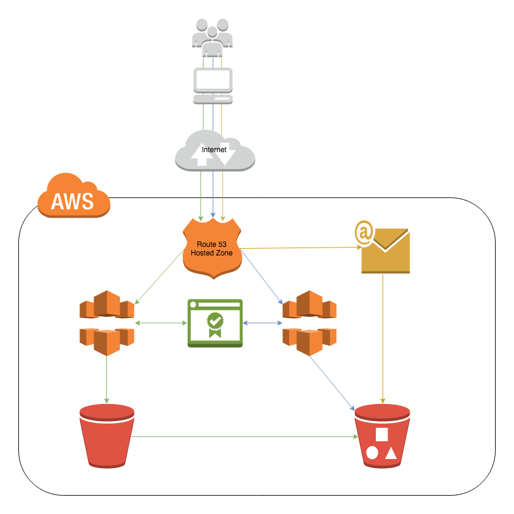

# PersonalWebsite
Personal website

* Google Domains
* Hosted on AWS s3
* SSL certificates generated with Amazon Certificate Manager (AWS ACM)
* SSL implemented with AWS CloudFront distribution 
* DNS congfiured with AWS Route53
* Email domain and server configured with Simple Email Services

Next Steps: 
* Add personal statement and location information 
* Work on caching (image performance)
* Create Projects page
* Google analytics
