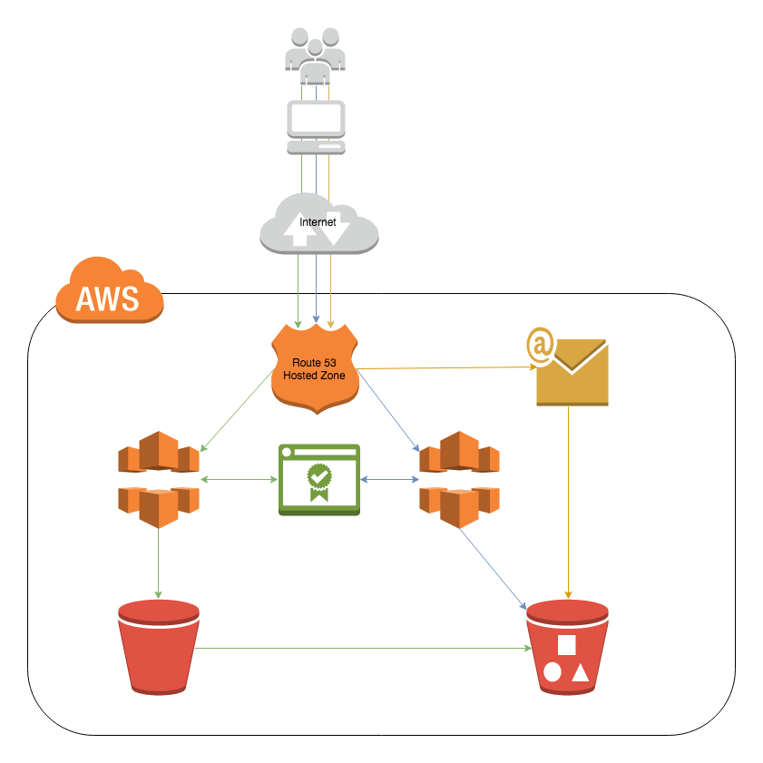

My Website
---

## About
My personal space on the web.

## Logic
* Website built with Bulma Framework
* Google Domains
* Hosted on AWS s3
* SSL certificates generated with Amazon Certificate Manager (AWS ACM)
* SSL implemented with AWS CloudFront distribution 
* DNS configured with AWS Route53
* Email domain and server configured with Simple Email Services

